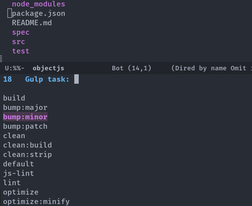
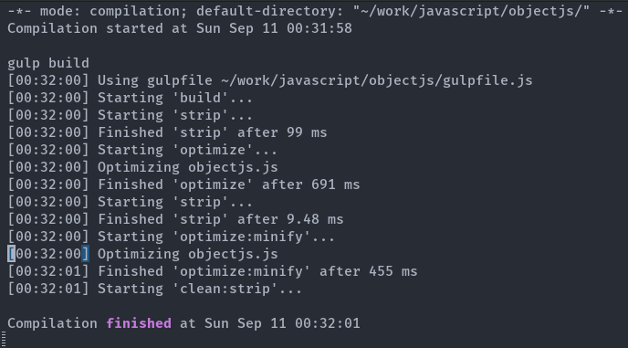

# Run Gulp tasks from Emacs

Repository mirrored from [https://petton.fr/git/nico/gulp-task-runner](https://petton.fr/git/nico/gulp-task-runner).

This package provides a straightforward integration
of [Gulp](http://gulpjs.com/) in Emacs.  Evaluate =M-x gulp= to get the list of
gulp tasks of a project and run a task.

Tasks are run in a compilation buffer.

# Screenshots

